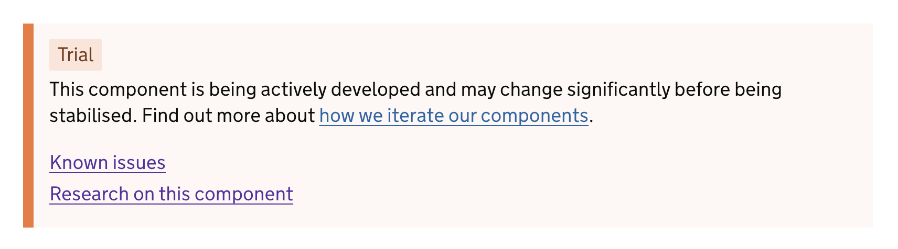



Our [contribution criteria](/community/contribution-criteria/) ensures that stable components within the design system have met certain criteria.

There are occasions when it may be beneficial to release a component earlier in it's lifecycle to gain feedback from the community or allow services to trial it with users.

## Component lifecycle

A component lifecyle outlines how components develop over time within the design system. With the use of a [component status](#component-status) we communicate our level of confidence that a component is suitable for use.

The design system trials new components, iterates existing ones, and retires ones that do not pass review to adapt to evolving user needs, current research, and technologies.

The parts of the lifecycle that you will see on the website are: trial &rarr; stable.

There are additional stages to the lifecycle that we may add as statuses if users find this component information useful.

### Trial components or variants

You will see a 'Trail' tag added to entire components or variants of components.

This tag ensures you know that something is in it's Trial state.

A Trial is likely to be something...

- new or represents a significant change
- potentially valuable but needs further testing in services
- that is actively being working on

You can/ cannot use trial components in live services [if/unless x conditions are met, which are ...].

- [x]
- [x]

Often these components need feedback from the community to transistion to ‘Stable’. Components that have been in ‘Trial’ for 6 months may be moved to ‘Stable’ if no conflicting feedback is received.

### Stable components

If a component does not have a tag it will be considered 'Stable'.

You can still share feedback and research about stable components.

## Component status

Lifecycle information for status tagged components in the design system.

      {{ govukTaskList({
        idPrefix: "component-statuses",
        classes: "govuk-!-padding-left-0",
        items: [
          {
            title: {
              text: "Accordion"
            },
            href: "/components/accordion/",
            status: {
             text: "Stable"
            }
          },
          {
            title: {
              text: "Back-link"
            },
            href: "/components/back-link/",
            status: {
             text: "Stable"
            }
          },
          {
            title: {
              text: "Breadcrumbs"
            },
            href: "/components/breadcrumbs/",
            status: {
             text: "Stable"
            }
          },
          {
            title: {
              text: "Button"
            },
            href: "/components/button/",
            status: {
             text: "Stable"
            }
          },
          {
            title: {
              text: "Character count"
            },
            href: "/components/character-count/",
            status: {
             text: "Stable"
            }
          },
          {
            title: {
              text: "Checkboxes"
            },
            href: "/components/checkboxes/",
            status: {
             text: "Stable"
            }
          },
          {
            title: {
              text: "Cookie banner"
            },
            href: "/components/cookie-banner/",
            status: {
             text: "Stable"
            }
          },
          {
            title: {
              text: "Date input"
            },
            href: "/components/date-input/",
            status: {
             text: "Stable"
            }
          },
          {
            title: {
              text: "Details"
            },
            href: "/components/details/",
            status: {
             text: "Stable"
            }
          },
          {
            title: {
              text: "Error message"
            },
            href: "/components/error-message/",
            status: {
             text: "Stable"
            }
          },
          {
            title: {
              text: "Error summary"
            },
            href: "/components/error-summary/",
            status: {
             text: "Stable"
            }
          },
          {
            title: {
              text: "Exit this page"
            },
            href: "/components/exit-this-page/",
            status: {
             text: "Stable"
            }
          },
          {
            title: {
              text: "Feedback"
            },
            href: "#",
            status: {
              tag: {
                text: "Trial",
                classes: "govuk-tag--orange"
              }
            }
          },
          {
            title: {
              text: "Fieldset"
            },
            href: "/components/fieldset/",
            status: {
             text: "Stable"
            }
          },
          {
            title: {
              text: "File upload"
            },
            href: "/components/file-upload/",
            status: {
             text: "Stable"
            }
          },
          {
            title: {
              text: "Generic header"
            },
            href: "/components/generic-header/",
            status: {
             text: "Stable"
            }
          },
          {
            title: {
              text: "GOV.UK footer"
            },
            href: "/components/footer/",
            status: {
             text: "Stable"
            }
          },
          {
            title: {
              text: "GOV.UK header"
            },
            href: "/components/header/",
            status: {
             text: "Stable"
            }
          },
          {
            title: {
              text: "Inset text"
            },
            href: "/components/inset-text/",
            status: {
             text: "Stable"
            }
          },
          {
            title: {
              text: "Notification banner"
            },
            href: "/components/notification-banner/",
            status: {
             text: "Stable"
            }
          },
          {
            title: {
              text: "Pagination"
            },
            href: "/components/pagination/",
            status: {
             text: "Stable"
            }
          },
          {
            title: {
              text: "Panel"
            },
            href: "/components/panel/",
            status: {
             text: "Stable"
            }
          },
          {
            title: {
              text: "Password input"
            },
            href: "/components/password-input/",
            status: {
             text: "Stable"
            }
          },
          {
            title: {
              text: "Phase banner"
            },
            href: "/components/phase-banner/",
            status: {
             text: "Stable"
            }
          },
          {
            title: {
              text: "Radios"
            },
            href: "/components/radios/",
            status: {
             text: "Stable"
            }
          },
          {
            title: {
              text: "Select"
            },
            href: "/components/select/",
            status: {
             text: "Stable"
            }
          },
          {
            title: {
              text: "Service navigation"
            },
            href: "/components/service-navigation/",
            status: {
             text: "Stable"
            }
          },
          {
            title: {
              text: "Skip link"
            },
            href: "/components/skip-link/",
            status: {
             text: "Stable"
            }
          },
          {
            title: {
              text: "Summary list"
            },
            href: "/components/summary-list/",
            status: {
             text: "Stable"
            }
          },
          {
            title: {
              text: "Table"
            },
            href: "/components/table/",
            status: {
             text: "Stable"
            }
          },
          {
            title: {
              text: "Tabs"
            },
            href: "/components/tabs/",
            status: {
             text: "Stable"
            }
          },
          {
            title: {
              text: "Task list"
            },
            href: "/components/task-list/",
            status: {
             text: "Stable"
            }
          },
          {
            title: {
              text: "Text input"
            },
            href: "/components/text-input/",
            status: {
             text: "Stable"
            }
          },
          {
            title: {
              text: "Textarea"
            },
            href: "/components/textarea/",
            status: {
             text: "Stable"
            }
          },
          {
            title: {
              text: "Warning text"
            },
            href: "/components/warning-text/",
            status: {
             text: "Stable"
            }
          }
        ]
      }) }}

## Tell us how you are using components

Community contribution at each stage of the component lifecycle is essential.

Letting us know that you are using a component, or not using a component for a specific reason are both types of feedback that you can provide. If you have more detailed research you can [share findings about your users](/community/share-research-findings/), we want to hear this too.
