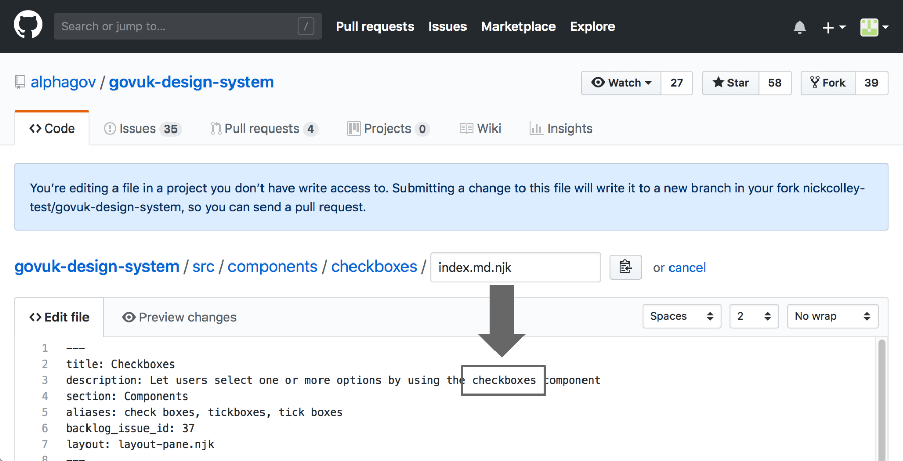



The GOV.UK Design System team uses a service called GitHub to manage content in the GOV.UK Design System.

This guide explains how to propose a change to the Design System's content. You'll need a GitHub account to do this.

If you do not have one already, you can [create a GitHub account for free](https://github.com/).

{{ govukInsetText({
  text: "Rest assured that it's impossible for you to break the Design System by proposing changes. The GOV.UK Design System team reviews all changes before publishing."
}) }}

If you get stuck whilst following these steps and you need help, you can:

- get in touch on [#govuk-design-system channel on cross-government Slack](https://ukgovernmentdigital.slack.com/app_redirect?channel=govuk-design-system)
- email the GOV.UK Design System team on  <govuk-design-system-support@digital.cabinet-office.gov.uk>

## 1. Go to the page you want to edit

At the bottom of every page in the Design System you will find a section called 'Help improve this page'.

Follow the link to propose a change to the page. This will take you to the page's Markdown file.

You might be told you need to fork the Design System repository to make changes. This is nothing to worry about. It just means you're making a copy of the Design System that you can edit. Select "fork this repository and propose changes" to continue.

## 2. Edit the page file

Edit the Markdown to make your change.

Here is an example showing how to update the description of the checkboxes component.

In this example, the uppercase ‘C’ on the word ‘Checkbox’ has been changed to lowercase.

## 3. Propose your change

Once you’re happy, find the section called 'Propose file change' at the bottom of the page.

Add a short description explaining the reason for your change in the first field. This information will be added to the file’s changelog. Try to be as clear as possible, to help future users understand the update.

If you need to provide more information about your change, you can add more detail in the larger field below.

When you are happy with your description, select ‘propose file change’. You'll have a chance to review and confirm your changes on the next page.

## 4. Confirm your changes

You'll be shown a confirmation page where you can review the changes you’ve made.

If you spot a mistake, you can go back to the previous page and correct it.

If you are happy with your changes, select ‘Create pull request’. You'll have one more chance to review your change on the next page before you submit it to the GOV.UK Design System team to review.

## 5. Create a pull request

A pull request is a request to the GOV.UK Design System team to add (‘pull’) your changes into the project and publish them in the Design System.

Once you’ve created a pull request, your proposed change and any comments you’ve written will be publicly visible meaning that anyone can see them on GitHub.

You’ll see the description you entered in step 3 and can add some additional information if you want to.

Once you’re happy, select ‘create pull request’.

## 6. Wait for the team to review your pull request

The GOV.UK Design System team will be notified of your suggestion and will review it.

The team will either:

- accept your proposal and publish your change straight away
- accept your proposal but ask for some changes before publishing
- not accept your proposal and explain why
