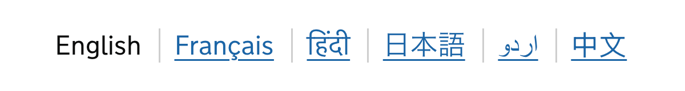




This component is being actively developed and may change significantly before being stabilised. We welcome <a href="#research-on-this-component">any research findings</a> on this or similar components. Find out more about <a href="#">how we iterate components</a>.


Allow users to access content and services in their preferred language.

## When to use this component

Use the language switcher component to provide a list of languages that your content or service is available in.

## When not to use this component

Do not use the language switcher if your content is only available in English or if the other languages provided do not provide a comparable service to English.

## How it works

The language switcher provides a list of links to the page in other languages. These links should be placed within [Service navigation](/components/service-navigation/) if they affect the entire service, or outside of the navigation if a translation only exists for the current page.

Each link should direct to the current page's equivalent in the selected language. Translated pages should provide content and functionality that is equivalent to the English language version.

### Labelling languages

Language links should be labelled with the name of the language, as written in its own language (its endonym).

For example:

- Cymraeg instead of 'Welsh'
- Français instead of 'French'
- اَلْعَرَبِيَّةُ instead of 'Arabic'
- 中文 instead of 'Chinese' or 'Simplified Chinese'

Language labels should be marked up with the `lang` HTML attribute containing the [two-letter ISO 639 code](https://en.wikipedia.org/wiki/List_of_ISO_639_language_codes) for the language.

Languages with a right-to-left reading direction, such as Arabic and Hebrew, should additionally include the `dir="rtl"` HTML attribute and value.

Do not use country flags to indicate language. The same language may be spoken in a number of languages, and a country can have multiple official languages.

## Research on this component

We're still gathering research on this component.

You can contribute any research findings about the Language switcher [on the backlog discussion on GitHub](https://github.com/alphagov/govuk-design-system-backlog/issues/285) or by [contacting the Design System team](/contact/).
