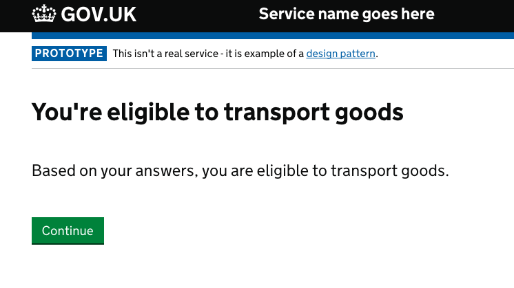




Ask users questions to help them work out if they can or should use your service.



{{ govukTag({
  text: "WCAG 2.2",
  classes: "app-tag"
}) }}

### New WCAG 2.2 criteria might affect this pattern

To help users to 'Check a service is suitable' and meet the new WCAG 2.2 criteria, make sure that users can successfully:

- [use the service without repeating answers they've already given](/patterns/check-a-service-is-suitable/#wcag-avoid-repeating-questions)

See the full list of components and patterns affected on our ['Changes to meet WCAG 2.2' page](/accessibility/WCAG-2.2/#components-and-patterns-affected-in-the-design-system).


{{ govukInsetText({
  html: wcagCallout,
  attributes: {
    style: 'border-left-color: #1d70b8;'
  }
})}}

Doing this helps users save time as it tells them upfront whether they are eligible to use it and if they need it.

It can also help reduce time and money spent processing queries from users confused about whether they’re eligible to use your service, or if it’s suitable for them.

  {{ govukTag({
    text: "WCAG 2.2",
    classes: "app-tag"
  }) }}
  
Make sure to not repeat questions or request information the user will need to re-provide later.

  
If during the process a service is determined to be suitable, consider offering a secure method to carry forward relevant responses into the service journey, unless carrying forward would be a major safety concern.

  
You can make it easier to enter the same information within the service through one of these methods:

  <ul>
    <li>pre-populating the relevant fields</li>
    <li>showing carried-forward responses as an option for the user to select</li>
  </ul>
  
This is to comply with WCAG 2.2 success criterion <a href="https://www.w3.org/WAI/WCAG22/Understanding/redundant-entry.html">3.3.7 Redundant Entry</a>.

## When to use this pattern

If you have complicated eligibility requirements you should follow this pattern. This will save users from having to read through large amounts of documentation outside of your service to work out if they can use it.

Use this pattern to help users work out:

- if they’re eligible to use your service
- how much it will cost them to use
- how much money they will get
- how long it will take to get something

Read guidance about designing your service so you [give users information at the point they need it](https://www.gov.uk/service-manual/design/govuk-content-transactions) in the GOV.UK Service Manual.

## When not to use this pattern

Do not use this pattern if you can reasonably include information users need to know about your service and its eligibility requirements on a start page.

## How it works

You should help people find out whether your service is right for them as soon as you&nbsp;can.

When using this pattern you need to:

- ask a series of simple questions
- automatically work out what a user needs to know
- present the user with a ‘results’ page

If there are general rules about whether a service can or cannot be used such as an age limit or fixed deadline, include these on the start page.

### Presenting results

Your results page should show the user if they’re eligible to use it. Where applicable, it should also show them:

- if they have to use your service
- how much it will cost them to use it
- how much money they’ll get from using it
- how long the whole process will take

If a user is not eligible to use your service, explain why and, if possible, tell them what they should do instead.

Here’s an example of a results page:

## Research on this pattern

Read a blog post about [testing and iterating this pattern](https://designnotes.blog.gov.uk/2017/03/30/weve-published-the-check-before-you-start-pattern/).

Please note this pattern used to be called ‘Check before you start’.
