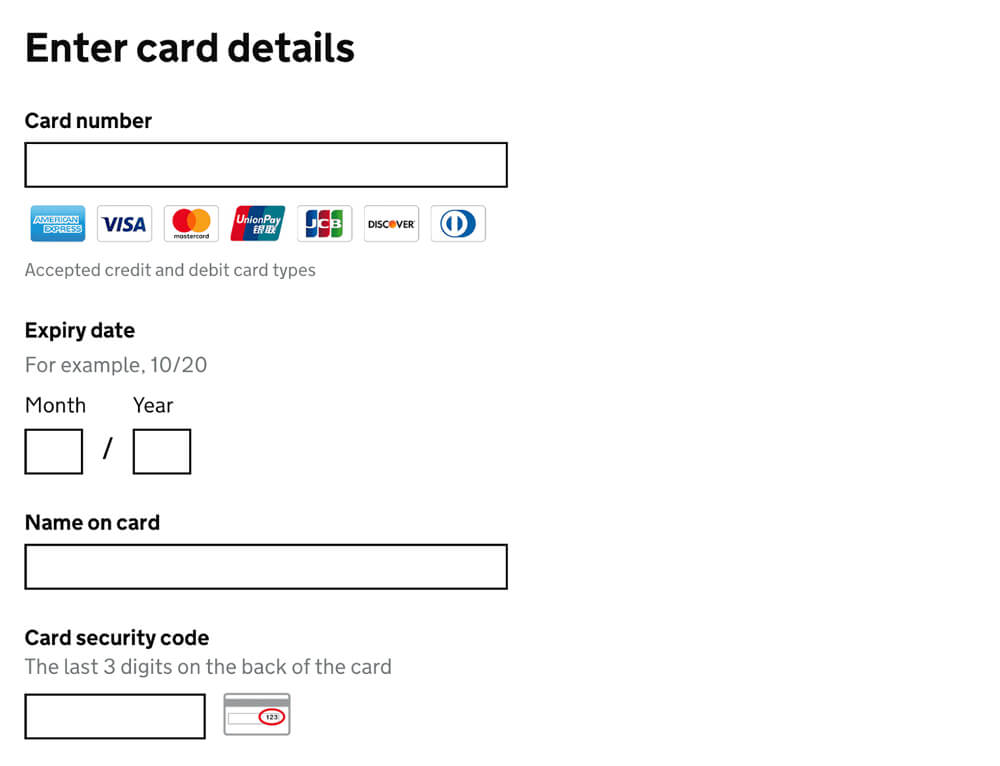




This guidance is for government teams that build online services. [To find information and services for the public, go to GOV.UK](https://www.gov.uk/).



{{ govukTag({
  text: "WCAG 2.2",
  classes: "app-tag"
}) }}

### New WCAG 2.2 criteria affects this pattern

To ask users for 'Payment card details' and meet the new Web Content Accessibility Guidelines (WCAG) 2.2 criteria, make sure that users can successfully:

- [interact the with month and year fields, by adding adequate spacing between them](/patterns/payment-card-details/#wcag-spacing-month-year)

See the full list of [components and patterns affected by WCAG 2.2](/accessibility/WCAG-2.2/#components-and-patterns-affected-in-the-design-system).


{{ govukInsetText({
  html: wcagCallout,
  classes: "app-inset-text"
}) }}

## When to use this pattern

Before using this pattern, check if [GOV.UK Pay](https://www.payments.service.gov.uk/) is suitable for your service.

If you cannot use GOV.UK Pay and need to build your own payment service, follow this pattern to collect payment card details from your users.

## How it works

### Allow different formats

Let users enter payment card numbers in whatever format is familiar to them. Allow additional spaces, hyphens and dashes.

### Help users enter valid card information

Present all fields on a single page, in the order in which they appear on a credit or debit card. This makes it easy for users to transcribe the information from their payment card.

  {{ govukTag({
    text: "WCAG 2.2",
    classes: "app-tag"
  }) }}
  
Make sure to add adequate spacing between the month and year fields. Ideally, leave at least 24px of space between the fields, either horizontally (inline) or vertically. This is to make sure users can easily interact with the fields. This relates to WCAG 2.2 success criterion <a href="https://www.w3.org/WAI/WCAG22/Understanding/target-size-minimum.html">2.5.8 Target Size (minimum)</a>.

Show logos for the cards you accept as icons so users can see whether their card is supported.

Use Issuer Identification Number (IIN) lookups to validate the card number as the user enters it. Once you’ve been able to identify the user’s card type, leave only the relevant logo highlighted and grey out the others.

  <video class="app-video__player" role="region" aria-labelledby="card-number-video-description" controls muted>
    <source src="card-number.mp4" type="video/mp4">
  </video>
  

    This video shows the card number validation in practice. It does not have any audio.
  

If JavaScript is not available, display all of the logos anyway, as they still help users to understand which card types you support.

When you validate the card number, the card security code information should update according to the type of card being used. For example, if a user enters an American Express card, the hint text and icon should change to match the front of the card.

Do not use CVV or other acronyms for the card security code.

If you need to ask for a user's name elsewhere in your service, do not assume that the name on their card will be the same.

## Research on this pattern

This pattern is based on the one used in [GOV.UK Pay](https://www.payments.service.gov.uk/), which has been live since November 2016.

The GOV.UK Pay team tests this pattern quarterly as part of its user research.

### Services using this pattern

As of August 2018 the following services were using this pattern as part of GOV.UK Pay.

**Office of the Public Guardian** 
Lasting Power of Attorney

**Ministry of Justice** 
Send money to a prisoner

**Border Force** 
Registered Traveller: faster entry through the UK border 
Global Entry: apply for faster entry to the USA 
Electronic Visa Waiver

**Disclosure and Barring Service** 
Basic Disclosure 
Disclosure Scotland

**HM Courts and Tribunals** 
Probate Fees 
Civil Money Claims 
Divorce Fees

**Foreign and Commonwealth Office** 
Emergency Travel Documents

**Ministry of Defence** 
Defence Academy

**Department for Digital, Culture, Media & Sport** 
Government Art Collection 
Press Accreditation

**Department for International Trade** 
Overseas Market Introduction Service

**Nottingham University Hospitals NHS Trust** 
Private Care

**Land Registry** 
Local Land Charges

**Environment Agency** 
Waste Permitting
