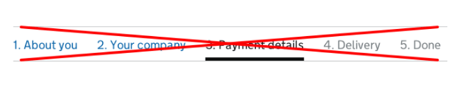



This pattern explains when to use question pages and what elements they need to include.

{{ example({ group: "patterns", item: "question-pages", example: "default", html: true, nunjucks: true, open: false, loading: "eager" }) }}

## When to use this pattern

Follow this pattern whenever you need to ask users questions within your service.

You should make sure you know why you’re asking every question and only ask users for information you really need.

To help you work out what to ask, you can carry out a [question protocol](https://www.uxmatters.com/mt/archives/2010/06/the-question-protocol-how-to-make-sure-every-form-field-is-necessary.php).

If you ask for optional information:

- in most contexts, add ‘(optional)’ to the labels of optional fields
- for [Radios components](/components/radios/) and [Checkboxes components](/components/checkboxes/), add ‘(optional)’ to the legend

Never mark mandatory fields with asterisks.

On every question page you should:

- make sure it’s clear to users why you’re asking each question
- allow users to answer ‘I do not know’ or ‘I’m not sure’ if they are valid responses

Read more about [designing good questions](https://www.gov.uk/service-manual/design/designing-good-questions) in the GOV.UK Service Manual.

## How it works

Question pages must include a:

- back link
- page heading
- continue button

If research shows it’s helpful for users, you can also include a [progress indicator](#using-progress-indicators).

Make sure to only ask for a piece of information once within a single journey. Whenever possible, do not ask a user to re-enter information they’ve already provided.

If the same type of information is needed more than once, make it easier to reuse previously entered answers through one of these methods:

- pre-populating the relevant fields
- showing carried-forward responses as an option for the user to select

### Back link

Some users do not trust browser back buttons when they’re entering data.

Always include a [Back link component](/components/back-link/) at the top of question pages to reassure them it’s possible to go back and change previous answers.

However, do not break the browser back button. Make sure it takes users to the previous page they were on, in the state they last saw it.

An exception to this is when the user has performed an action they should only do once, like make a payment or complete an application. The browser back button should still work, but show the user a sensible message rather than let them perform the action again.

### Page headings

Page headings can be questions or statements.

#### Start by asking one question per page

Asking just one question per question page helps users understand what you’re asking them to do, and focus on the specific question and its answer.

To help you follow this approach, you can set the contents of a `<legend>` or `<label>` for a page’s input as the page heading. This is good practice as it means that users of screen readers will only hear the contents once.

Read more about why and [how to set labels and legends as headings](/get-started/labels-legends-headings/) or see examples below.

A question page with a legend as the page heading:

{{ example({ group: "patterns", item: "question-pages", example: "date-of-birth", html: true, nunjucks: true, open: false }) }}

A question page with a label as the page heading:

{{ example({ group: "patterns", item: "question-pages", example: "postcode", html: true, nunjucks: true, open: false }) }}

Do not use the same page heading across multiple pages.

The page heading should relate specifically to the information being asked for on the current page, not any higher-level section the page is part of.

If you need to show the high-level section, you can use the `govuk-caption` style.

For example, ‘About you’

{{ example({ group: "patterns", item: "question-pages", example: "section-headings", html: true, open: true, hideTab:true }) }}

You can also learn more about how starting with [one thing per page](https://www.gov.uk/service-manual/design/form-structure#start-with-one-thing-per-page) helps users in the GOV.UK Service Manual.

#### Hint text

Use hint text to show information that helps the majority of users answer the question, like how their information will be used, or where to find it.

Keep each hint to a single short sentence, without any full stops.

If you need to give a long, detailed explanation, do not use hint text. Screen readers will read out the entire text when users interact with the form element. This could frustrate users if the text is long.

Do not use links in hint text. While screen readers will read out the link text when describing the field, they usually do not tell users the text is a link.

#### Asking complex questions without using hint text

If you're asking a question that needs a detailed explanation, use:

- a `h1` heading that's a statement (for example, 'Interview needs') rather than a question
- whatever mix of text, paragraphs, lists and examples best explains your question to users
- a label, above the form input, that asks users a specific question – for example, 'Do you have any interview needs?'

{{ example({ group: "patterns", item: "question-pages", example: "explanatory-text", html: true, nunjucks: true, open: false }) }}

#### Asking multiple questions on a page

Sometimes it makes sense to group a number of related questions on the same page.

User research will tell you when you can group pages together. For example, if you’re designing an internal service for government users who need to repeat and switch between tasks quickly.

If you need to ask for multiple related things on a page, use a statement as the heading.

You can style each `<label>` or `<legend>` to make the questions easier to scan. Read more about why and [how to style labels and legends](/get-started/labels-legends-headings/#styling-options-for-labels-and-legends).

{{ example({ group: "patterns", item: "question-pages", example: "passport", html: true, nunjucks: true, open: false }) }}

### Continue button

Make sure your ‘Continue’ button is:

- labelled ‘Continue’, not ‘Next’
- aligned to the left so users do not miss it

### Using progress indicators

Start by testing your form without a progress indicator to see if it’s simple enough that users do not need one.

Try improving the order, type or number of questions before adding a progress indicator. If people still have difficulty, try adding a simple step or question indicator like this one.

{{ example({ group: "patterns", item: "question-pages", example: "progress", html: true, nunjucks: true, open: false }) }}

Only include the total number of questions if you can do so reliably. As the user moves through the form, make sure the indicator updates to tell them which question they are on and the total number remaining.

Do not use progress indicators that do all of the following:

- show all questions at once
- allow navigation to previous questions
- show the current question

An example of this looks like:

These can be problematic because they:

- are often not noticed
- take up lots of space
- do not scale well on small screens
- can distract and confuse some users
- make it hard to write good labels for the steps
- make it hard to handle conditional sections

A number of GOV.UK services have removed this style of progress indicator without any negative effects. Read a blog post about [how the Carer’s Allowance team removed a 12-step progress indicator](https://designnotes.blog.gov.uk/2014/07/07/do-less-problems-as-shared-spaces/) with no effect on completion rates or times.

### Using range sliders

Avoid using [range slider](https://developer.mozilla.org/en-US/docs/Web/HTML/Element/input/range) questions, where the user needs to click and drag a selector across a range of answers or values. These types of controls are difficult for some users to interact with.

If you do use a range slider, you must provide a method for selecting an answer that doesn’t rely on ‘click and drag’ movements. This relates to [WCAG success criterion 2.5.1 Pointer Gestures](https://www.w3.org/TR/WCAG22/#pointer-gestures).
