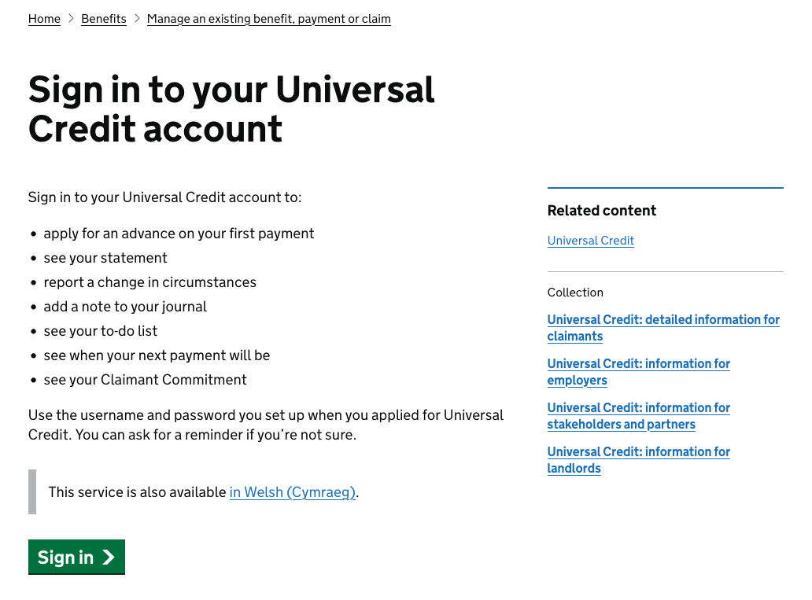
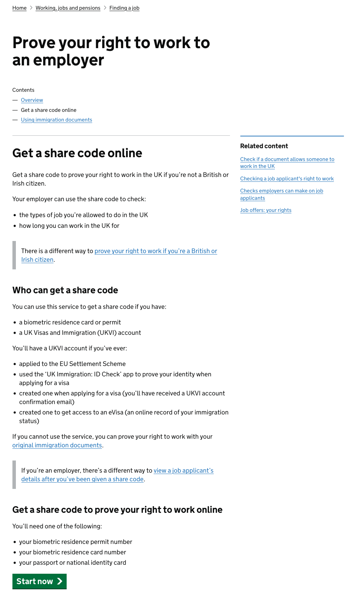

GOV.UK services must start on a GOV.UK content page. This links your service to the rest of GOV.UK, and means that users can find it using search or through GOV.UK’s navigation.

## When to use this pattern

Use this pattern to help you prototype a start point for your service, so you can test as much of the user journey as possible.

The public-facing version of your service will need to start on a GOV.UK content page, published using one of the GOV.UK publishing apps. You’ll usually need to agree content for this GOV.UK content page with the GDS content team. Read [guidance on how to get your service on GOV.UK](https://www.gov.uk/service-manual/service-assessments/get-your-service-on-govuk).

## How it works

A service's start point should:

- give the user just enough information to help them understand what the service does and whether it will meet their need — including [giving the service a name that reflects the problem it solves for users](https://www.gov.uk/service-manual/design/naming-your-service)
- include a ‘button’ linking into the service, with text that’s consistent with the action you’re asking users to take — for example, ‘Start now’, ‘Sign in’ or ‘Register or update your details’ (if you need a secondary call to action, use a standard link)
- let users sign in, resume an application they’ve already started or update their details (if relevant)
- include any other information that most users are likely to need before they start using the service online — for example, how much it costs to use the service and roughly how long it will take
- include details of other ways to access the service — for example, by telephone or by completing a paper form

You’ll also need to list any documents or information the user will need to help them complete the service (there’s no need to list information that a user is likely to know from memory — for example, their own date of birth).

You can list the documents or information at the start point, if it does not make the page too complicated. Or you can move these details to a separate ‘What you’ll need’ page, served within the service subdomain.

## Eligibility

Avoid using the start point to provide complex eligibility information. Instead, ask questions inside the service to find out whether the user is eligible.

Read [guidance on designing how GOV.UK content and transactions work together](https://www.gov.uk/service-manual/design/govuk-content-transactions).

## Choosing a format for a start point on GOV.UK

The options available depend on whether the start point will be published as ‘mainstream’ or ‘Whitehall’ content.

Mainstream content is content aimed at the general public — or at meeting business needs that are not sector-specific.

The content team at GDS is responsible for creating mainstream start points on GOV.UK, as with other mainstream content. They’ll work with you to make sure the journey from GOV.UK into the service works as well as possible. It’s a good idea to [talk to your organisation’s content team during alpha](https://www.gov.uk/service-manual/service-assessments/get-your-service-on-govuk#before-your-alpha-assessment) — if necessary, they can put you in touch with the team at GDS.


### Mainstream start points

For a mainstream start point, the options are:

- a simple start page
- a start point within a multipart guide

Use a simple start page if users can start using the service without needing much context.



If the start point is linked to a wider process that needs more explanation, create an ‘Apply’ section within a multipart guide.

For example, before a user applies for probate (the right to manage someone’s estate after they die) they need to understand whether probate is required, whether they’re the right person to apply, how the details of the will and the tax situation affect what they’re supposed to do, how to get the relevant information together and how the different outcomes affect what they'll need to do next.

It’s important that users have this context, so it makes sense to embed the start point within the multipart guide — rather than creating the start point as a separate start page, allowing users to miss the context and potentially do the wrong thing.



The Carer’s Allowance team found that, for their service, [providing a start point within a multipart guide helped users get to the right information without feeling overwhelmed](https://dwpdigital.blog.gov.uk/2014/07/24/improving-to-the-carers-allowance-guide/).

### Creating a start point using Whitehall Publisher

For non-mainstream services, publishers in departments with access to the ‘Whitehall’ app can create a simple start page using the ‘detailed guide’ format.

Use this Markdown to create a button within a detailed guide:

```plaintext
{button start}[Button text goes here](https://servicename.service.gov.uk/first-page-within-service){/button}
```
