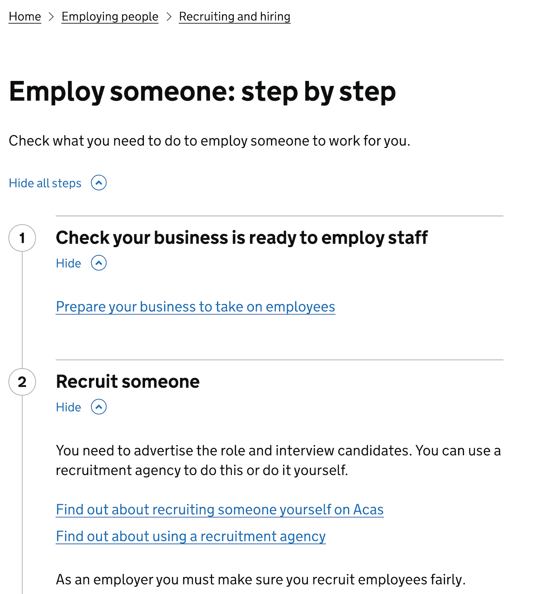
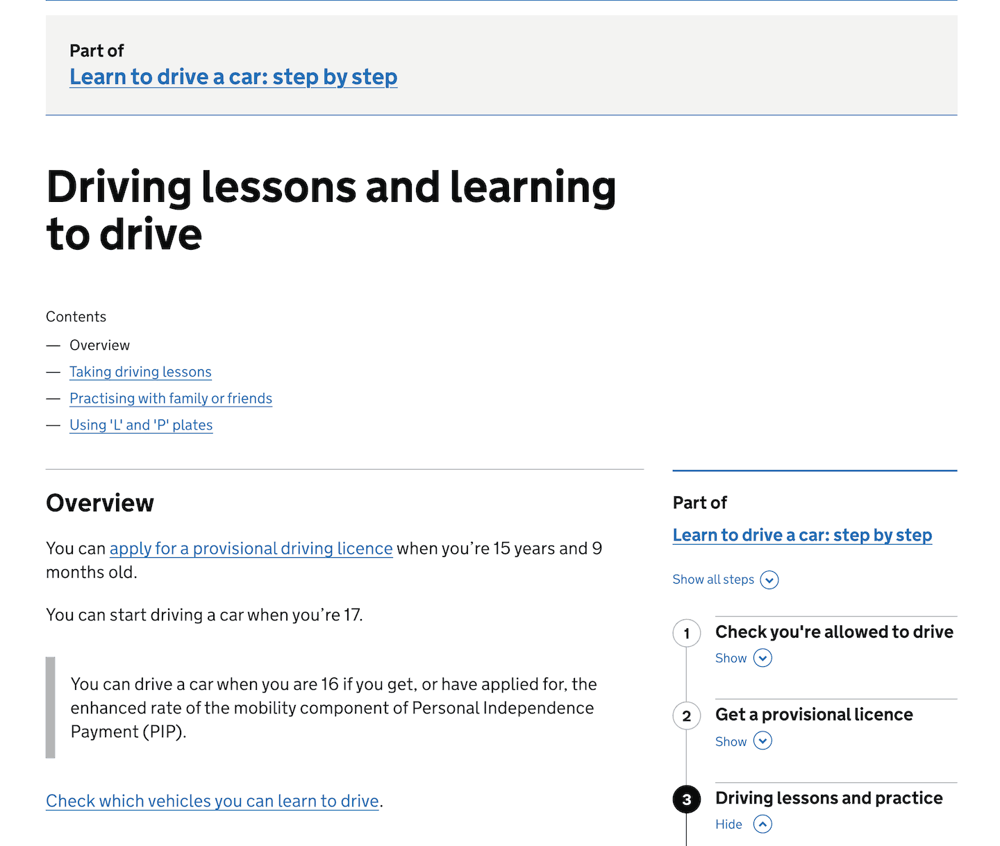
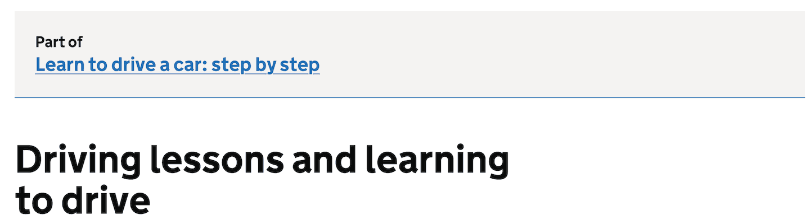
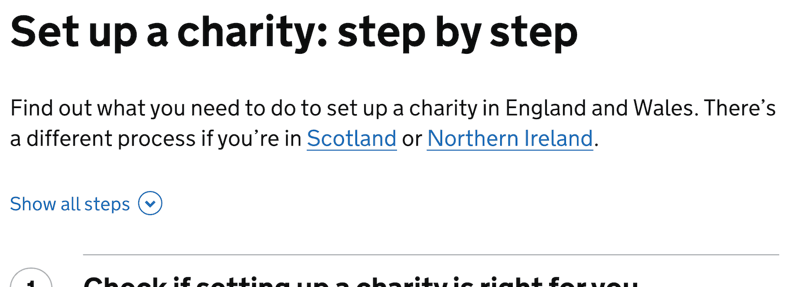
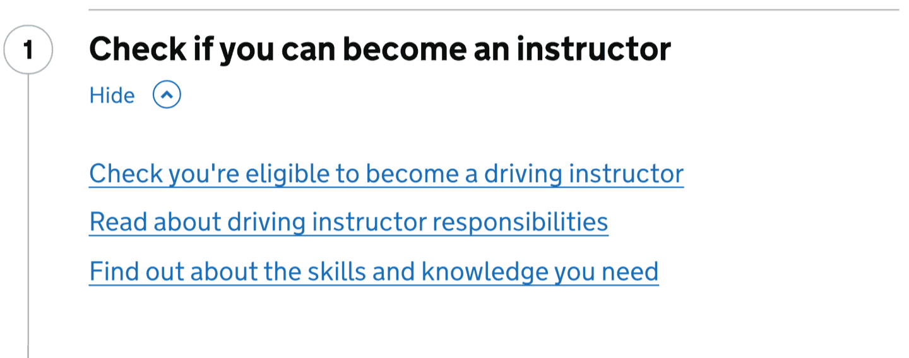
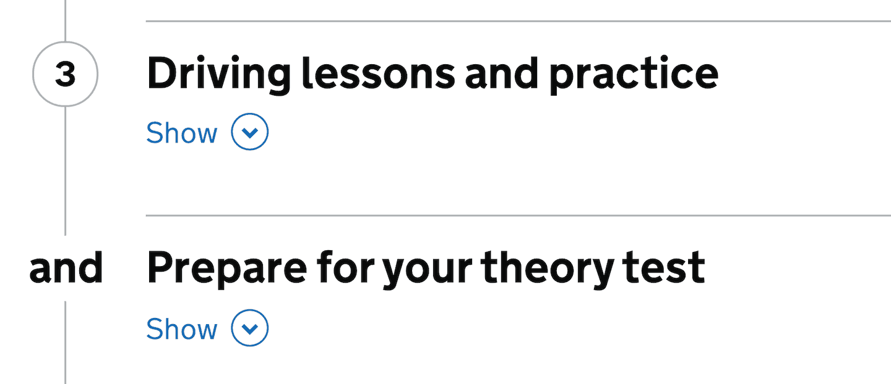
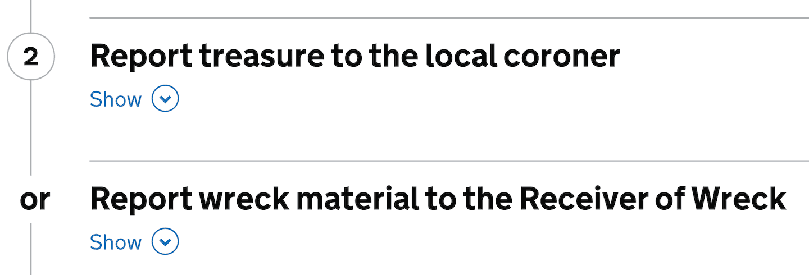
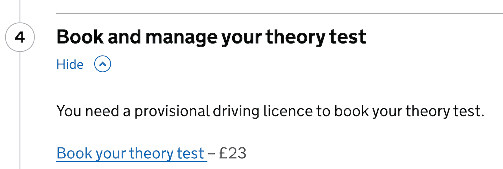
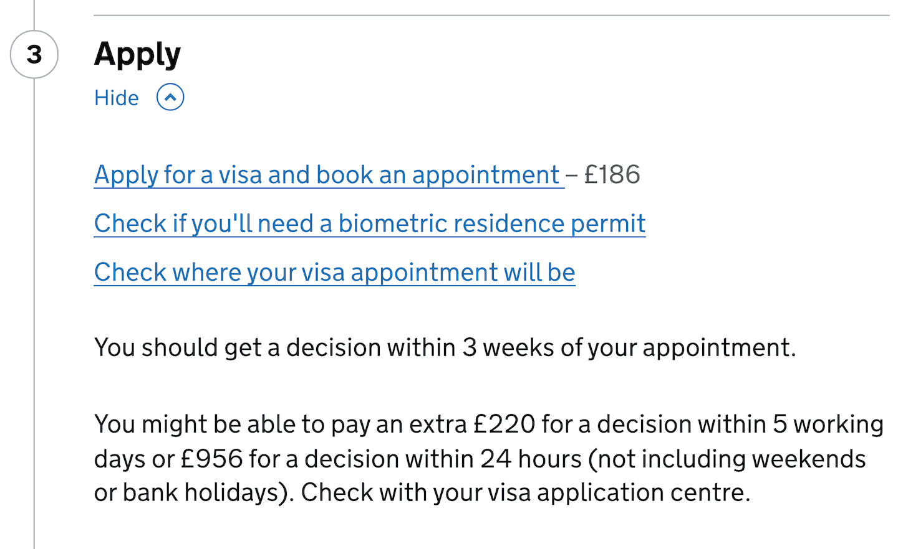

The step by step navigation pattern presents an end to end journey in logical steps, with links to content that helps users complete each step.

The Government Digital Service (GDS) works with departments to build step by step navigation journeys on GOV.UK. You will not be able to publish step by step navigation you’ve created yourself on the live GOV.UK site: this pattern is for use in your prototype only.

If you can, get a content designer to work on your prototype and help you decide what content fits in your step by step navigation.

If you want to suggest new step by step navigation for the GOV.UK live site, ask the content team in your department to contact GOV.UK using the [GOV.UK content change form](https://support.publishing.service.gov.uk/content_change_request/new) (requires a password).

## When to use this pattern

GOV.UK uses step by step navigation to represent end to end journeys:

- that have a specific start and end point
- that require the user to interact with several pieces of guidance or transactions on GOV.UK
- where it’s helpful for the user to complete tasks in a specific order

## When not to use this pattern

Do not use the step by step pattern:

- when most of the guidance or services that make up the journey are not on GOV.UK
- when the user only needs to read guidance and not take an action
- when there’s no logical or helpful order to complete the tasks - for example, when you’re mostly presenting the user with a series of options
- inside a transactional service – use the [task list pattern](/patterns/task-list-pages/) instead

## How it works

A step by step navigation journey can:

- bring together guidance and transactions from different departments, agencies, services and topics
- be completed in one go, or require the user to return to at different times
- link to content and services outside government
- include both online and offline actions

When you prototype a step by step journey, do not customise the design. If you did, it would not be a realistic representation of the pattern as it would eventually appear on the GOV.UK live site.

Step by step navigation is displayed in 2 ways.

1. On the right hand sidebar of content pages that are part of the step by step navigation.

   

2. As a standalone page.

   

You can use [install the 'Step By Step' plugin](https://prototype-kit.service.gov.uk/docs/install-and-use-plugins) in the GOV.UK Prototype Kit to prototype a step by step.

Remember that step by step navigation is not for use within transactional services. We have included it in the Prototype Kit only so you can prototype your end to end journeys. Unlike most other components and patterns in the Design System, we do not provide the code for step by step navigation in `govuk-frontend`.

Content pages that are part of the step by step navigation always have a link at the top that goes to the standalone step by step page.

### Elements of step by step navigation

#### Introduction

This is a short statement describing what the step by step helps the user to do.

You can also use it to tell users when this step by step navigation is not relevant to them. For example, if the process is different in another region.

Users do not see the introduction in the sidebar, so do not add anything vital there.

#### Steps

A step is a task or group of tasks that a user can complete as part of the journey. They appear in the pattern as numbered sections. The user can click on the step to expand it.

#### Tasks

A task is an action you need to take or piece of content you need to read to help you complete a step. They appear as a single link or a list of links.

Different tasks can link to the same service or piece of content.

You can present tasks in bullet points if you need to show:

- different ways to perform the same task - for example, different versions of a form to download
- different conditions that change how the user should complete the task

### Order steps according to user needs

Steps and tasks should be listed in the order users need to complete them.

If there is not a set order, they should be listed in an order that helps the user.

For example, ‘Agree a contract and salary’ is listed as step 4 in ‘Employ someone: step by step’ although it can be completed earlier.

Make sure the step number is read out to screen reader users when they navigate to a step's main `button` element.

### Use both ‘and’ and ‘or’

Use ‘and’ to show when you can or must complete steps at the same time. You can use ‘and’ for more than 2 steps.

Use ‘or’ to show when there’s a choice between 2 steps, or when a task must be completed in a different way based the user’s circumstances or eligibility.

When adding ‘and‘ or ‘or‘ steps, make sure screen reader users can easily tell the difference between additional information or actions included in this step and the other numbered steps. Do this by nesting non-sequential ‘and‘ or ‘or‘ step names as sub-headings (usually `<h3>`) within the related step.

### Costs

If there is a cost for completing a task, show it after the link text.

### Text within a step

Only include text in the step if it gives:

- essential context that the user needs before they click on the link
- the conditions the user needs to meet to complete the task - for example, if only some users can do it

## Research on this pattern

The step by step navigation pattern was created by the Government Digital Service (GDS).

While developing the pattern, they ran 8 rounds of research with users, including those with disabilities and people with low digital literacy.

The pattern was also reviewed by the Digital Accessibility Centre.

Read more about researching and iterating step by step navigation in the following blog posts:

- [Building end to end services into GOV.UK](https://gds.blog.gov.uk/2017/11/30/building-end-to-end-services-into-gov-uk/)
- [How we approached service mapping](https://insidegovuk.blog.gov.uk/2018/02/07/how-we-approached-service-mapping/)
- [Building a better step by step](https://gds.blog.gov.uk/2018/10/17/building-a-better-gov-uk-step-by-step/)

### Known issues and gaps

Users rarely use the step by step navigation header, which might suggest the purpose of it is not clear to them.

Users get frustrated when looping back and forth between step by steps. It’s OK to link from one step by step to another, but not to link from the second step by step back to the first.

It’s not currently possible to include step by step navigation on confirmation pages.

### Services using this pattern

This pattern is commonly used across GOV.UK. You can see examples of it being used in the following services.

**Driver and Vehicle Standards Agency** 
Learn to drive a car

**Department for Work and Pensions** 
Employ someone 
What to do when someone dies

**UK Visas and Immigration** 
Visit the UK on a Standard Visitor visa

**Department for Transport** 
Get a Blue Badge

See a list of [live services using step by step navigation [GOV.UK Developer docs]](https://docs.publishing.service.gov.uk/document-types/step_by_step_nav.html#example-pages)).

### Next steps

More user research is needed to find out:

- if it’s useful to add step by step navigation to pages that are related but not linked to from that step by step
- how turning off in-page navigation on guides that have step by steps affects the experience of mobile users, as this has only been tested on desktop
- how users navigate from one step by step to another
- how users navigate from mainstream browse to step by steps
