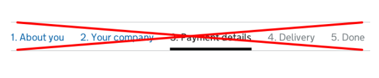





Most services require specific questions for the users to answer. This guidance discusses some of the elements to include or consider.



{{ govukTag({
  text: "WCAG 2.2",
  classes: "app-tag"
}) }}

### New WCAG 2.2 criteria affects this pattern

To use ‘Question pages' and meet the new Web Content Accessibility Guidelines (WCAG) 2.2 criteria, make sure that users can successfully:

- [avoid re-entering information they've given in a previous answer](/patterns/question-pages/#wcag-reenter-previous-answer)
- [select an answer without relying on 'click and drag' movement](/patterns/question-pages/#wcag-select-without-click-drag)

See the full list of [components and patterns affected by WCAG 2.2](/accessibility/wcag-2.2/#components-and-patterns-affected-in-the-design-system).


{{ govukInsetText({
  html: wcagCallout,
  classes: "app-inset-text"
}) }}

{{ example({ group: "setting-up-your-service", item: "question-pages", example: "default", html: true, nunjucks: true, open: false }) }}

## What to consider when asking users questions in a service

On every question page you should:

- make sure it’s clear to users why you’re asking each question
- only ask users for information you really need
- allow users to answer ‘I do not know’ or ‘I’m not sure’ if they are valid responses
- usually only ask one question for each page
- group related questions on the same page, if it makes sense to do so

You should also make sure you:

- only ask for a piece of information once within a single journey
- do not use the same page heading across multiple pages
- do not use hint text if you need to give a lengthy explanation with lists and paragraphs
- only use progress indicators if user research or feedback has indicated the users would benefit from having one in your service
- avoid using questions which the user needs to answer with a [range slider](https://developer.mozilla.org/en-US/docs/Web/HTML/Element/input/range)

To help you work out what questions to ask, you can read more about [designing good questions]() in the GOV.UK Service Manual and carry out a [question protocol]().

## Designing clearly written and presented questions

Designing good question pages makes it easy for users to provide the right information and understand why they need to provide it.

Question pages must include a:

- back link
- page heading
- continue button

Never mark mandatory fields with asterisks.

If you ask for optional information:

- in most instances you can add ‘(optional)’ to the labels of optional fields
- for [radios](https://design-system.service.gov.uk/components/radios/) and checkboxes, add ‘(optional)’ to the legend

If research shows it’s helpful for users, you can also include a [progress indicator](#using-progress-indicators).

  {{ govukTag({
    text: "WCAG 2.2",
    classes: "app-tag"
  }) }}
  
Whenever possible, do not ask a user to re-enter information they’ve already provided. This is to comply with WCAG 2.2 success criterion <a href="https://www.w3.org/WAI/WCAG22/Understanding/redundant-entry.html">3.3.7 Redundant Entry</a>.

If the same type of information is needed more than once, make it easier to reuse previously entered answers through one of these methods:

- pre-populating the relevant fields
- showing carried-forward responses as an option for the user to select

### Page headings

Page headings can be questions or statements. Out of necessity, this differs from the [GOV.UK style guide on headers](https://www.gov.uk/guidance/content-design/writing-for-gov-uk#headings) which recommends not using questions for headings as it’s hard to front-load them (putting the most important information first).

A question page with a legend as the page heading:

{{ example({ group: "setting-up-your-service", item: "question-pages", example: "date-of-birth", html: true, nunjucks: true, open: false }) }}

A question page with a label as the page heading:
{{ example({ group: "setting-up-your-service", item: "question-pages", example: "postcode", html: true, nunjucks: true, open: false }) }}

#### Do not use the same page heading across multiple pages.

Each page heading should relate specifically to the information you’re asking for on the current page. If the page is part of a wider topic/high-level section, the heading should be unique and not reuse the high-level section header.

If you need to show the high-level section, you can use the govuk-caption style.

For example, ‘About you’

{{ example({ group: "setting-up-your-service", item: "question-pages", example: "section-headings", html: true, open: true, hideTab:true }) }}

### Ask one question on each page

Asking just one question on each page helps users understand what you’re asking them to do, and focus on the specific question and its answer.

You can also learn more about how starting with [one thing per page](https://www.gov.uk/service-manual/design/form-structure#start-with-one-thing-per-page) helps users in the GOV.UK Service Manual.

To help you follow this approach, you can set the contents of a <legend> or <label> for a page’s input as the page heading. Doing this means that users of screen readers will only hear the contents once.

Read more about why and [how to set labels and legends as headings](https://design-system.service.gov.uk/setting-up-services/labels-legends-headings/) or see examples below.

### Asking multiple questions on a page

While it’s best to ask one question on each page, sometimes it makes sense to group a number of related questions on the same page.

User research will tell you when you can group pages together. For example, if you’re designing an internal service for government users who need to repeat and switch between tasks quickly.

If you need to ask for multiple related things on a page, use a statement as the heading.
You can style each `<label>` or `<legend>` to make the questions easier to scan. Read more about why and [how to style labels and legends](https://design-system.service.gov.uk/setting-up-services/labels-legends-headings/#styling-options-for-labels-and-legends).

{{ example({ group: "setting-up-your-service", item: "question-pages", example: "passport", html: true, nunjucks: true, open: false }) }}

### Continue button

Make sure your ‘Continue’ button is:

- labelled ‘Continue’, not ‘Next’
- aligned to the left so users do not miss it

### Back link

Some users do not trust browser back buttons when they’re entering data.

Always include a [back link](/components/back-link/) at the top of question pages to reassure them it’s possible to go back and change previous answers.

However, do not break the browser back button. Make sure it takes users to the previous page they were on, in the state they last saw it.

An exception to this is when the user has performed an action they should only do once, like make a payment or complete an application. The browser back button should still work, but show the user a sensible message rather than let them perform the action again.

### Asking complex questions without using hint text

Do not use hint text if you need to give a lengthy explanation with lists and paragraphs. Screen readers read out the entire text when users interact with the form element. This could frustrate users if the text is long.

Do not use links in hint text. While screen readers will read out the link text when describing the field, they will not tell users the text is a link.

If you’re asking a question that needs a detailed explanation, use:

- a `h1` heading that’s a statement (for example, ‘Interview needs’) rather than a question
- whatever mix of text, paragraphs, lists and examples best explains your question to users
- a label, above the form input, that asks users a specific question – for example, ‘Do you have any interview needs?’

{{ example({ group: "setting-up-your-service", item: "question-pages", example: "explanatory-text", html: true, nunjucks: true, open: false }) }}

### Using progress indicators

Start by testing your form without a progress indicator to see if it’s simple enough that users do not need one.

Try improving the order, type or number of questions before adding a progress indicator. If people still have difficulty, try adding a simple step or question indicator like this one.

{{ example({ group: "setting-up-your-service", item: "question-pages", example: "progress", html: true, nunjucks: true, open: false }) }}

Only include the total number of questions if you can do so reliably. As the user moves through the form, make sure the indicator updates to tell them which question they are on and the total number remaining.

Do not use progress indicators that do all of the following:

- show all questions at once
- allow navigation to previous questions
- show the current question

An example of this looks like:

These can be problematic because they:

- are often not noticed
- take up lots of space
- do not scale well on small screens
- can distract and confuse some users
- make it hard to write good labels for the steps
- make it hard to handle conditional sections

A number of GOV.UK services have removed this style of progress indicator without any negative effects. Read a blog post about [how the Carer’s Allowance team removed a 12-step progress indicator](https://designnotes.blog.gov.uk/2014/07/07/do-less-problems-as-shared-spaces/) with no effect on completion rates or times.

### Using range sliders

  {{ govukTag({
    text: "WCAG 2.2",
    classes: "app-tag"
  }) }}
  
Avoid using <a href="https://developer.mozilla.org/en-US/docs/Web/HTML/Element/input/range">range slider</a> questions, where the user needs to click and drag a selector across a range of answers or values. These types of controls are difficult for some users to interact with.

  
If you do use a range slider, you must provide a method for selecting an answer that doesn’t rely on ‘click and drag’ movements. This relates to WCAG success criterion <a href="https://www.w3.org/TR/WCAG22/#pointer-gestures">2.5.1 Pointer Gestures</a>.

