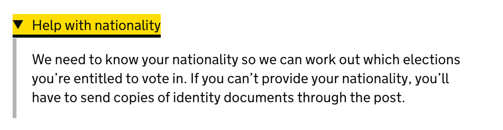
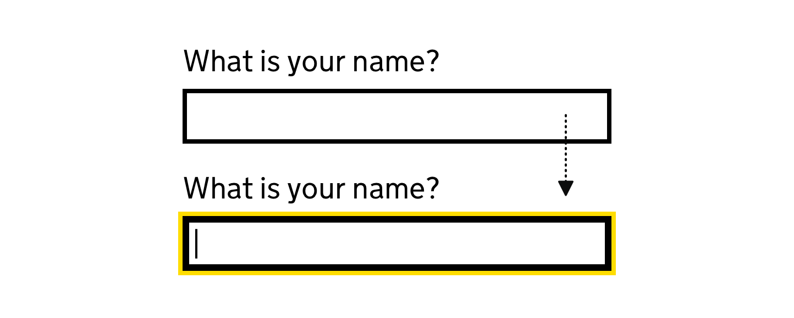
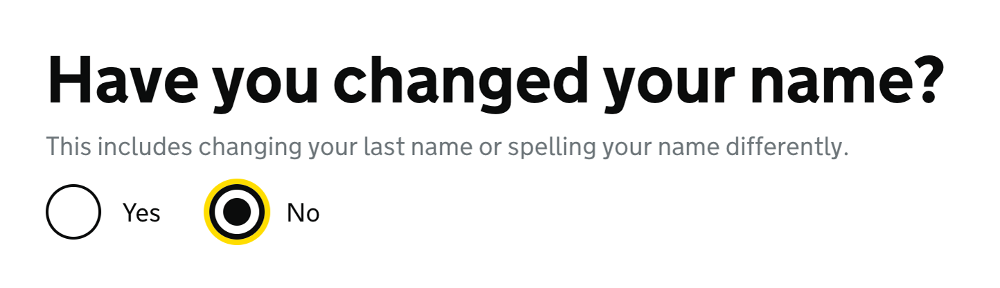



## Focus states

Some people use keyboards or other devices to navigate through a page by jumping from one interactive element to the next. Focus states let users know which element they’re currently on and is ready to be interacted with.

Focus states in the GOV.UK Design System use a combination of yellow and black to make sure they meet Web Content Accessibility Guidelines (WCAG) 2.1 level AA [non-text contrast](https://www.w3.org/WAI/WCAG21/Understanding/non-text-contrast.html) on any background colour used on GOV.UK.

The yellow has a high contrast with dark backgrounds and the thick black border has a high contrast against light backgrounds.

### Principles for focus states

A set of principles for focus states.

### Link focus state style

When links are focused, they have a yellow background with a black bottom border. This helps the focused link stand out from the rest of the content on the page.


Other components and elements that look like links use the link focus state style. For example, the controls on the [accordion](/components/accordion/) and [details](/components/details/) components.



### Form input focus state style

When form inputs are focused, they have a yellow outline and a thick black border. If the element already has a border, the border gets thicker.



[Radios](/components/radios/) and [checkboxes](/components/checkboxes/) use the same style.



### Making focus states accessible for extended and modified components

If you've [extended or modified components in the GOV.UK Design System](/get-started/extending-and-modifying-components/), you can use GOV.UK styles to make the focus states of these components accessible.

How you make focus states accessible depends on if the component is:

- focusable text without a background colour or border
- another focusable element with a background colour or border

#### Make focusable text accessible

If you use Sass, you should include the `govuk-focused-text` mixin in your component's `:focus` selector if that component is focusable text. For example, the component is a link in body text, or the details component:

```scss
.app-component:focus {
  @include govuk-focused-text;
}
```

#### Make other focusable elements accessible

If you use Sass, you can use 3 GOV.UK Frontend variables if your component has a background colour or border. For example a text input or checkbox.

The 3 Sass variables are:

- `$govuk-focus-colour` - yellow background
- `$govuk-focus-text-colour` - black text
- `$govuk-focus-width` - for consistent width

Use these variables in your components instead of numeric values for the background, text and widths.

### If you do not use Sass

To make a component's focus state accessible without using Sass, you can:

- see how the `govuk-focused-text` mixin works from the [GOV.UK Frontend source code](https://github.com/alphagov/govuk-frontend/blob/25a4333b239e1c3b8a136e526981fe29172a2852/src/govuk/helpers/_focused.scss#L12-L28)
- get the values for `$govuk-focus-colour` and `$govuk-focus-text-colour` from the [colour page](/styles/colour/)

## Hover states

An explanation of what a hover state is, why it is important and when it is used.

### Principles for hover states

A set of principles for hover states.

## Pressed states

An explanation of what a pressed state is, why it is important and when it is used.

### Principles for pressed states

A set of principles for pressed states.

## Inactive states

An explanation of what a inactive, sometimes referred to as disabled, state is, why it is important and when it is used.

### Principles for inactive states

A set of principles for inactive states.

## Error states or messages

An explanation of what an error state is, why it is important and when it is used.

### Principles for error states and messages

Follow the [validation pattern](/patterns/validation/) and show an [error message](/components/error-message/) when there is a validation error. 

In the error message explain what went wrong and how to fix it.

Use an [error summary](/components/error-summary/) at the top of a page to summarise any errors a user has made.

When a user makes an error, you must show both an error summary and an error message next to each answer that contains an error.

Type A - A red line to the left of the component and a error message above the component
Type B - A red line to the left of the component, an error message above the component and a red border for the input box
Type C - Thick red border around content

Error message | Type A & B
Error summary | Type C

Character count | Type B (with a custom red caption)
Checkboxes | Type A
Date input | Type B
File upload | Type A
Radios | Type A
Select | Type B (but no guidance about it)
Text input | Type B
Text area | Type B